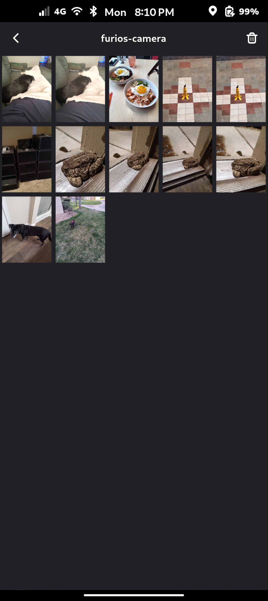
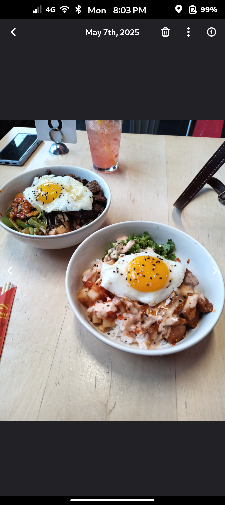

# FuriOS Gallery

A modern GTK4/Adw-based media gallery for FuriOS, featuring real-time indexing, thumbnail caching, albums, and rich media viewing (images & videos).

---

## Table of Contents

- [FuriOS Gallery](#furios-gallery)
  - [Table of Contents](#table-of-contents)
  - [Features](#features)
  - [Screenshots](#screenshots)
  - [Architecture](#architecture)
  - [Installation](#installation)
    - [Flatpak](#flatpak)
  - [Configuration \& Data Locations](#configuration--data-locations)

---

## Features

* **Albums View**: Browse and organize media into albums (Recents, Pictures, Videos, Screenshots, plus custom).
* **Grid View**: Fast scrolling, lazy-loaded thumbnails, multi-select and bulk delete.
* **Carousel Viewer**: Swipe or click through media with zoomable images and video playback.
* **Media Properties**: View EXIF metadata, video stream info, and GPS location on an interactive map.
* **Real‑Time Daemons**: Two systemd/pyinotify daemons for database indexing and thumbnail generation.
* **Custom Albums**: Create, add, remove, and delete albums and media items.

---

## Screenshots




---

## Architecture

* **`main.py`**: Entrypoint launching `GalleryApp` with an asyncio+GLib pump loop.
* **GUI Module** (`furios_gallery/`):

  * `gallery_window.py`: Main window, navigation, header, toolbar, bottom sheet.
  * `albums_view.py`, `grid_view.py`, `media_view.py`: Pages for browsing.
  * Widgets: `image_viewer_widget.py`, `video_player_widget.py`, `MediaPropertiesView`.
* **Database**: SQLite via `database_manager.py`; tables for files, albums, and associations.
* **Thumbnail Cache**: `thumbnail_utils.py` generates & caches PNG thumbnails under `~/.cache/thumbnails/large`.
* **Daemons**:

  * `gallery_daemon.py`: Launches two inotify-based watchers: `ThumbnailDaemon` and `DatabaseDaemon`.
* **Packaging**:

  * **Debian**: `debian/` folder with `control`, `rules`, `install`, `links`.
  * **Flatpak**: `io.FuriOS.Gallery.yml` manifest.


## Installation

### Flatpak

```bash
# Build & install from manifest
flatpak-builder --user --install-deps-from=flathub --install --force-clean build-dir io.FuriOS.Gallery.yml
```

## Configuration & Data Locations

| Purpose              | Location                                             |
| -------------------- | ---------------------------------------------------- |
| Database             | `~/.local/share/io.FuriOS.Gallery/gallery-albums.db` |
| Thumbnail Cache      | `~/.cache/thumbnails/large/`                         |
